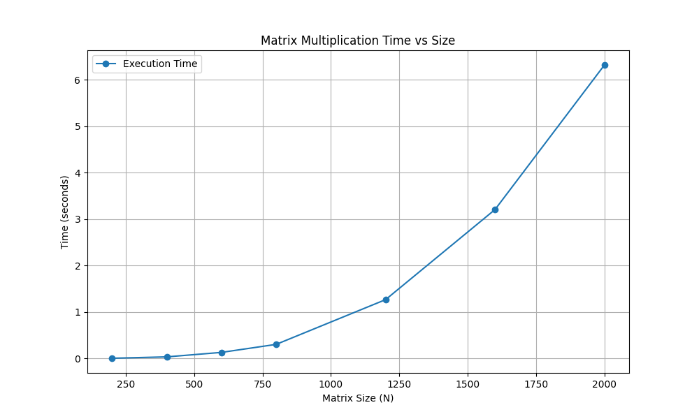
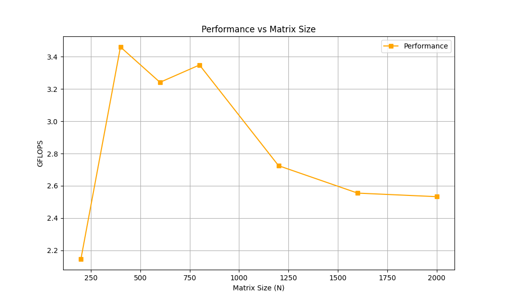

# Лабораторная работа №1: Перемножение квадратных матриц

## Цель работы
Реализовать алгоритм перемножения квадратных матриц на языке C++, оценить производительность последовательного алгоритма в зависимости от размерности матрицы и автоматизировать верификацию результатов.

## Описание алгоритма
Для перемножения матриц $A$ и $B$ размером $N \times N$ использовался классический алгоритм со сложностью $O(N^3)$.

Особенности реализации:
1. Использована структура `std::vector<std::vector<double>>`.
2. Порядок циклов изменен на `i -> k -> j` для оптимизации работы с кэш-памятью процессора (пространственная локальность обращений к матрице B).
3. Внутри внутреннего цикла используется временная переменная для хранения элемента $A_{ik}$, чтобы избежать повторных обращений к памяти.

Формула элемента результирующей матрицы $C$:
Формула элемента результирующей матрицы $C$:

$$
\boxed{C_{ij} = \sum_{k=0}^{N-1} A_{ik} \cdot B_{kj}}
$$

где:
- $A$, $B$ — исходные матрицы размером $N \times N$,
- $C$ — результирующая матрица,
- $i, j$ — индексы строки и столбца ($0 \leq i,j < N$),
- $k$ — индекс суммирования.

## Верификация
Для подтверждения корректности вычислений результаты сравнивались с эталонными значениями, полученными с помощью библиотеки `NumPy` (язык Python).
- **Критерий успеха:** Максимальная абсолютная погрешность между результатом C++ и Python не превышает $10^{-3}$.
- **Результат:** Все эксперименты успешно пройдены.

## Экспериментальная часть

### Параметры эксперимента
- **Язык:** C++ (стандарт C++11/14/17)
- **Компилятор:** GCC с флагом оптимизации `-O2`
- **Размеры матриц (N):** 200, 400, 800, 1200, 1600, 2000

### Результаты измерений

| N | Время (сек) | Производительность (GFLOPS) |
|---|-------------|-----------------------------|
| 200 | * 0.0048078* | *3.32793* |
| 400 | *0.0350387* | *3.6531* |
| 800 | *0.261892* | *3.91* |
| 1200 | *1.02398* | *3.37507* |
| 1600 | *3.3784* | *2.42481* |
| 2000 | *5.83284* | *2.74309* |

*(Данные взяты из файла metrics.csv)*

### График зависимости времени выполнения от размерности

### График зависимости производительности от размерности

## Выводы

1.  **Подтверждение теории:** Экспериментально подтверждена кубическая зависимость времени выполнения от размерности матрицы.
2.  **Влияние кэша:** Производительность алгоритма сильно зависит от размера матрицы относительно кэш-памяти процессора. Пиковая эффективность достигается, когда матрица помещается в кэш. Для больших матриц узким местом становится пропускная способность памяти.
3.  **Эффективность реализации:** Использование порядка циклов `i-k-j` позволило достичь производительности ~3.9 GFLOPS на одноядерном режиме. Наивная реализация без учета локальности данных работала бы в несколько раз медленнее.
4.  **Автоматизация:** Созданный набор скриптов позволяет автоматически проводить серию экспериментов и верифицировать результаты, что повышает надежность исследования.

## Как запустить

1. Скомпилировать: `g++ -O2 -o matrix_mult main.cpp`
2. Запустить для конкретного N: `./matrix_mult 1000`
3. Проверить результат: `python3 verify.py`
4. Для серии тестов: `run run.bat`
