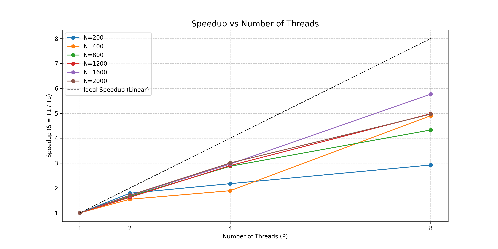
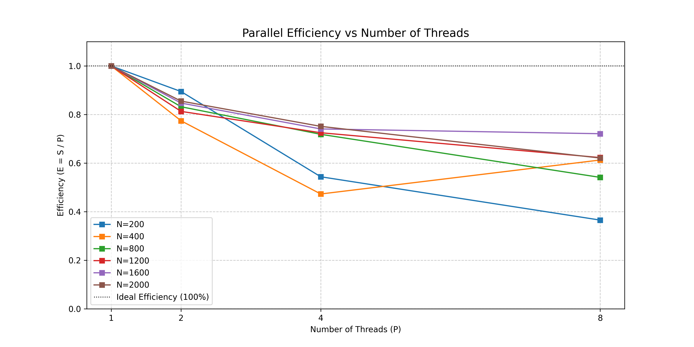

# Лабораторная работа №2: Параллельное перемножение матриц (OpenMP)

## 1. Цель работы
Модифицировать программу перемножения матриц для параллельного выполнения с использованием технологии OpenMP. Исследовать зависимость времени выполнения, ускорения (Speedup) и эффективности (Efficiency) от количества потоков и размера матрицы.

## 2. Описание реализации

### 2.1. Распараллеливание алгоритма
Для распараллеливания была использована директива OpenMP `#pragma omp parallel for`.

**Стратегия:**
Параллелизм применен к внешнему циклу по индексу $i$ (строки результирующей матрицы $C$):

$$
C_{ij} = \sum_{k=0}^{N-1} A_{ik} \cdot B_{kj}
$$
где:
- $A$, $B$ — исходные матрицы размером $N \times N$,
- $C$ — результирующая матрица,
- $i, j$ — индексы строки и столбца ($0 \leq i,j < N$),
- $k$ — индекс суммирования.

**Обоснование выбора:**
1.  **Независимость итераций:** Вычисление каждой строки матрицы $C$ не зависит от других строк. Это позволяет разным потокам обрабатывать разные строки одновременно без конфликтов записи (Race Condition).
2.  **Локальность данных:** Каждый поток работает со своей частью матрицы $C$, но читает всю матрицу $A$ и $B$. Поскольку $A$ и $B$ только читаются, проблем с когерентностью кэша при записи нет.
3.  **Балансировка нагрузки:** Использован параметр `schedule(dynamic)` для равномерного распределения задач между потоками.

### 2.2. Технические детали
*   **Библиотека:** OpenMP (`<omp.h>`)
*   **Компилятор:** GCC с флагом `-fopenmp`
*   **Количество потоков:** Устанавливается динамически через `omp_set_num_threads()`

## 3. Экспериментальная часть

### 3.1. Параметры эксперимента
*   **Процессор:** 8 ядер
*   **Размеры матриц ($N$):** 200, 400, 800, 1200, 1600, 2000
*   **Количество потоков ($P$):** 1, 2, 4, 8

### 3.2. Результаты измерений (Время в секундах)

| N \ Threads | 1 Thread | 2 Threads | 4 Threads | 8 Threads |
| :---: | :---: | :---: | :---: | :---: |
| **200** | 0.00409 | 0.00228 | 0.00188 | 0.00140 |
| **400** | 0.03498 | 0.02259 | 0.01850 | 0.00714 |
| **800** | 0.29193 | 0.17545 | 0.10158 | 0.06743 |
| **1200** | 1.05131 | 0.64665 | 0.36254 | 0.21104 |
| **1600** | 2.84289 | 1.67797 | 0.95971 | 0.49290 |
| **2000** | 5.82299 | 3.40437 | 1.93791 | 1.17251 |

*(Данные взяты из `metrics_parallel.csv`)*

### 3.3. Графики зависимостей

#### График ускорения (Speedup)


*Определение:* $S_p = \frac{T_1}{T_p}$, где $T_1$ — время на 1 потоке, $T_p$ — время на $p$ потоках.
Идеальное линейное ускорение показано пунктирной черной линией ($S_p = p$).

**Наблюдение:**
Для больших матриц ($N \ge 1200$) ускорение приближается к линейному росту. На 8 потоках для $N=2000$ достигнуто ускорение ~4.97 раза. Для малых матриц ($N=200$) ускорение значительно ниже идеального (~2.9 раза на 8 потоках) из-за накладных расходов на создание потоков.

#### График эффективности (Efficiency)


*Определение:* $E_p = \frac{S_p}{p}$. Показывает, какая доля процессорного времени используется полезно. Идеальная эффективность равна 1.0 (100%).

**Наблюдение:**
Эффективность падает с увеличением числа потоков, что является типичным поведением.
*   Для $N=2000$ эффективность на 8 потоках составляет около **62%**.
*   Для $N=200$ эффективность на 8 потоках падает до **37%**.
Это подтверждает, что распараллеливание выгодно только для достаточно больших объемов вычислений.

## 4. Анализ результатов и Выводы

1.  **Зависимость от размера матрицы:**
    *   Для малых матриц ($N=200, 400$) накладные расходы на управление потоками (создание, синхронизация, переключение контекста) сопоставимы с временем вычислений. Поэтому ускорение низкое, а эффективность быстро падает.
    *   С ростом $N$ ($N \ge 800$) полезная работа начинает доминировать. Ускорение растет, а эффективность стабилизируется на более высоком уровне.

2.  **Зависимость от количества потоков:**
    *   При переходе с 1 на 2 и 4 потока наблюдается значительный прирост производительности.
    *   При использовании 8 потоков (равном количеству физических ядер) ускорение для $N=2000$ составляет ~5x. Полное линейное ускорение (8x) недостижимо из-за закона Амдала (наличие последовательных участков кода, таких как генерация матриц или ввод/вывод) и ограничений подсистемы памяти.

3.  **Влияние архитектуры памяти:**
    *   Падение эффективности на большом числе потоков также связано с конкуренцией за пропускную способность шины памяти. Когда 8 ядер одновременно обращаются к оперативной памяти для чтения матриц $A$ и $B$ и записи в $C$, возникают задержки.

4.  **Верификация:**
    *   Корректность параллельных вычислений подтверждена сравнением с результатами последовательного алгоритма и библиотеки NumPy. Расхождения находятся в пределах погрешности типа `double`.

## 5. Инструкция по запуску

1.  **Компиляция:**
    ```bash
    g++ -O2 -std=c++17 -fopenmp -o matrix_mult_omp.exe main.cpp
    ```
2.  **Запуск одного теста:**
    ```bash
    ./matrix_mult_omp.exe 1000 4
    ```
    *(Где 1000 — размер матрицы, 4 — количество потоков)*
3.  **Серия экспериментов:**
    Запустите `run_lab2.bat`.
4.  **Построение графиков:**
    ```bash
    python plot_lab2.py
    ```