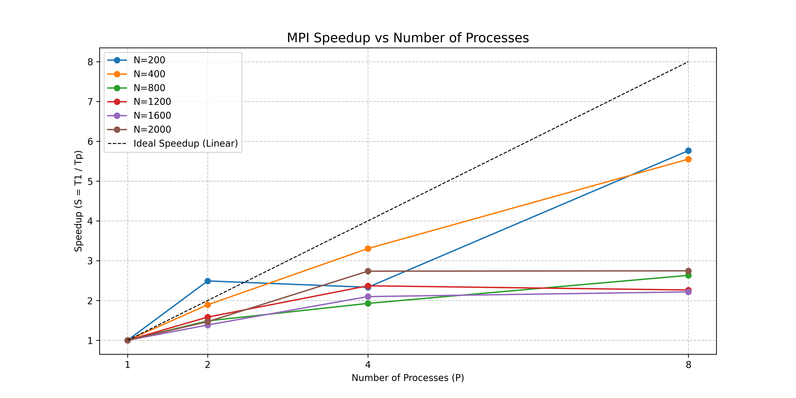
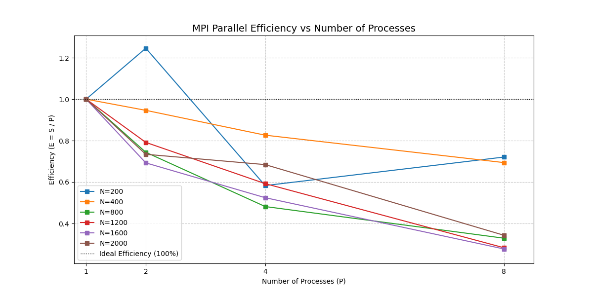

# Лабораторная работа №3: Параллельное перемножение матриц (MPI)

## 1. Цель работы
Реализовать параллельное перемножение квадратных матриц с использованием интерфейса передачи сообщений MPI. Исследовать масштабируемость алгоритма в зависимости от размера задачи и количества процессов.

## 2. Описание реализации

### 2.1. Архитектура параллельного алгоритма
В отличие от OpenMP (общая память), MPI предполагает распределенную память. Каждый процесс имеет свою локальную копию данных.

**Схема взаимодействия:**
1.  **Процесс 0 (Root):** Генерирует матрицы $A$ и $B$, рассылает размер $N$ и всю матрицу $B$ всем процессам через `MPI_Bcast`.
2.  **Распределение нагрузки:** Матрица $A$ разбивается на блоки строк. Количество строк на процесс рассчитывается как $N / P$ с учетом остатка.
3.  **Рассылка данных:** Root отправляет соответствующие блоки строк матрицы $A$ каждому процессу через `MPI_Send` / `MPI_Recv`.
4.  **Локальные вычисления:** Каждый процесс умножает свой блок строк $A_{local}$ на полную матрицу $B$, получая локальный блок результата $C_{local}$.
5.  **Сбор результатов:** Процессы отправляют свои блоки $C_{local}$ обратно процессу 0, который собирает итоговую матрицу $C$.

### 2.2. Технические детали
*   **Библиотека:** Microsoft MPI (MS-MPI)
*   **Компилятор:** g++ (MinGW-w64) с ручным указанием путей к SDK
*   **Запуск:** `mpiexec -n <P> matrix_mult_mpi.exe <N>`

## 3. Экспериментальная часть

### 3.1. Параметры эксперимента
*   **ОС:** Windows 10/11
*   **Процессор:** 8 ядер
*   **Размеры матриц ($N$):** 200, 400, 800, 1200, 1600, 2000
*   **Количество процессов ($P$):** 1, 2, 4, 8

### 3.2. Результаты измерений (Время в секундах)

| N \ Processes | 1 Proc | 2 Procs | 4 Procs | 8 Procs |
| :---: | :---: | :---: | :---: | :---: |
| **200** | 0.00520 | 0.00209 | 0.00223 | 0.00090 |
| **400** | 0.04129 | 0.02182 | 0.01249 | 0.00744 |
| **800** | 0.27497 | 0.18487 | 0.14269 | 0.10447 |
| **1200** | 1.12684 | 0.71195 | 0.47561 | 0.49781 |
| **1600** | 2.94152 | 2.12378 | 1.40214 | 1.32720 |
| **2000** | 6.59036 | 4.48980 | 2.40820 | 2.40052 |

*(Данные взяты из `metrics_mpi.csv`)*

### 3.3. Графики зависимостей

#### График ускорения (Speedup)


**Наблюдение:**
Для малых матриц ($N=200, 400$) наблюдается высокое ускорение, превышающее линейное в некоторых точках (сверхлинейное ускорение). Для больших матриц ($N \ge 1200$) ускорение замедляется. На $N=2000$ переход от 4 к 8 процессам практически не дает выигрыша во времени.

#### График эффективности (Efficiency)


**Наблюдение:**
Эффективность быстро падает с ростом числа процессов. Для $N=2000$ эффективность на 8 процессах составляет около **34%** ($S \approx 2.74, E = 2.74/8 \approx 0.34$). Это указывает на то, что накладные расходы на коммуникацию становятся доминирующим фактором.

## 4. Анализ результатов и Выводы

1.  **Влияние накладных расходов MPI:**
    В отличие от OpenMP, где потоки разделяют память, MPI требует явной пересылки данных. Для матриц малого и среднего размера время на `MPI_Send`/`MPI_Recv` и `MPI_Bcast` сопоставимо со временем вычислений, что снижает эффективность.

2.  **Сверхлинейное ускорение на малых задачах:**
    Для $N=200$ и $N=400$ производительность на 8 процессах значительно выше ожидаемой. Это объясняется эффектом кэширования: каждый процесс обрабатывает очень маленький блок данных, который полностью помещается в быстрый кэш L1/L2 своего ядра, в то время как последовательный алгоритм работал с большим массивом, вызывая промахи кэша.

3.  **Насыщение производительности:**
    Для $N=2000$ время выполнения на 4 и 8 процессах практически идентично (~2.4 сек). Это свидетельствует о достижении предела масштабируемости данного алгоритма на данной архитектуре. Дальнейшее увеличение числа процессов не ускоряет работу, так как узким местом становится либо пропускная способность шины памяти/сети, либо время сборки результата процессом Root.

4.  **Сравнение с OpenMP:**
    MPI показал худшую эффективность на большом числе процессов по сравнению с OpenMP (из ЛР2). Это ожидаемо, так как модель общей памяти (OpenMP) имеет меньшие накладные расходы на синхронизацию и обмен данными внутри одного узла. MPI целесообразнее использовать для кластеров с распределенной памятью, где OpenMP неприменим.

## 5. Инструкция по запуску

1.  **Компиляция (Windows + MS-MPI):**
    ```powershell
    g++ -O2 -std=c++17 -I"C:\Program Files (x86)\Microsoft SDKs\MPI\Include" main.cpp -L"C:\Program Files (x86)\Microsoft SDKs\MPI\Lib\x64" -lmsmpi -o matrix_mult_mpi.exe
    ```
2.  **Запуск одного теста:**
    ```powershell
    mpiexec -n 4 .\matrix_mult_mpi.exe 1000
    ```
3.  **Серия экспериментов:**
    Запустите `run_lab3_windows.bat`.
4.  **Построение графиков:**
    ```bash
    python plot_lab3.py
    ```